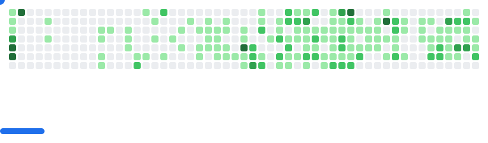

## 📖 &nbsp;&nbsp; About me
- 👨‍💻 **Software Engineer** at [**Zetra**](https://www.linkedin.com/company/zetra-mobility/)
- 👔 Former **Financial Consultant** with 5 years of experience.
- 🎓 Studied at [**HEC Geneva**](https://www.unige.ch/hec/), [**Grenoble Ecole de Management**](https://www.grenoble-em.com/), and [**42 Paris**](https://42.fr/en/homepage/)
- 🚧 Check out my **personal website** by clicking [**here**](https://karlquerel.com/)

## 📫 &nbsp;&nbsp; How to reach me

  
  

## ⚡ &nbsp;&nbsp; Languages

  
  
  
  
  
  

## 🧩 &nbsp;&nbsp; Frameworks

  
  
  
  

## 🛠 &nbsp;&nbsp; Tools

  
  
  
  
  
  
  
  
  
  
  
  
  

<picture>
  <source
    media="(prefers-color-scheme: dark)"
    srcset="images/breakout-dark.svg"
  />
  <source
    media="(prefers-color-scheme: light)"
    srcset="images/breakout-light.svg"
  />
  
</picture>

